# 🧾 Tamper-Evident Append-Only Log System

## 🏢 Potens IT Services and Consultancy Pvt. Ltd. – Internship 2026

A cryptographically secure, append-only logging system built with Node.js, Express, PostgreSQL, and Prisma.

This system ensures that every event is **immutable, traceable, and verifiable**, making it suitable for audit-grade systems.

---

# 🚀 Overview

This project implements a **tamper-evident logging system** inspired by blockchain principles.

Each log entry:
- Is appended only once
- Cannot be modified or deleted
- Is cryptographically linked using SHA-256
- Is verifiable at any time
- Is grouped into Merkle batches for scalable verification

---

# 🧠 Core Architecture

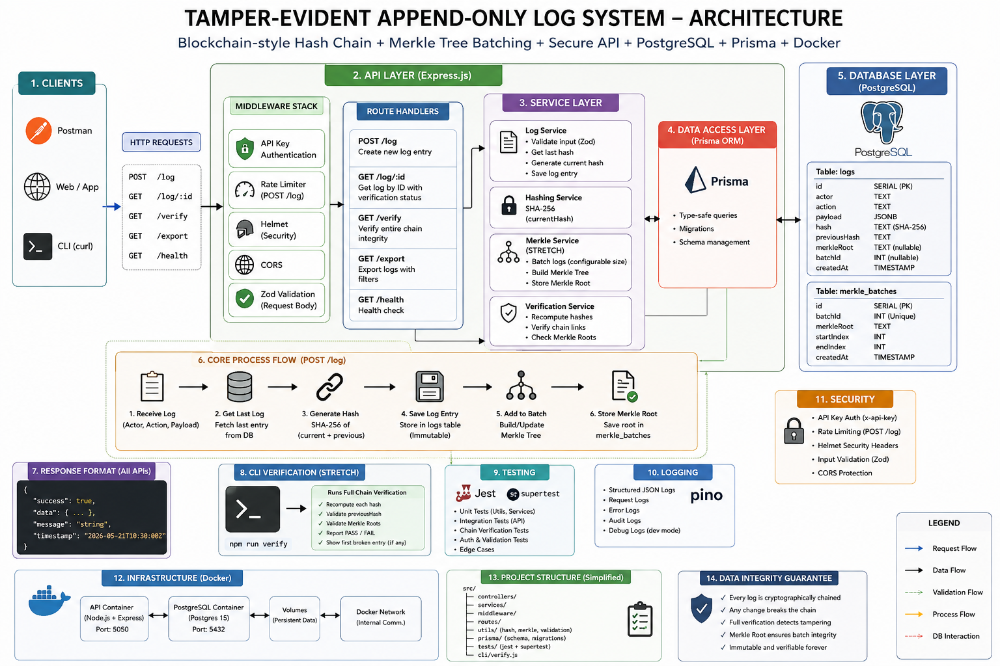

- Node.js + Express (Backend API)
- PostgreSQL (Database)
- Prisma ORM (Schema & migrations)
- SHA-256 (Chain integrity hashing)
- Merkle Tree (Batch verification optimization)
- Pino (Structured logging)
- Docker Compose (Containerized setup)
- Jest + Supertest (Testing)
- Zod (Validation layer)
- Commander.js (CLI verifier)

---

# 🔐 Key Features

## 1. Append-Only Log System
- `POST /log` accepts:
```json
{
  "actor": "string",
  "action": "string",
  "payload": {}
}
````

Each entry stores:

* SHA-256 hash
* Previous hash reference
* Immutable timestamp

---

## 2. Chain Verification

### `GET /verify`

Scans entire log chain and ensures:

* Hash integrity
* Previous hash consistency
* Detects first broken entry

Returns:

* PASS / FAIL
* Broken entry ID (if any)

---

## 3. Log Retrieval

### `GET /log/:id`

Returns:

* Log entry
* Chain verification status

---

## 4. Export API

### `GET /export`

Supports filtering:

* By actor
* By date range

Returns structured JSON export.

---

## 5. API Security

* API Key authentication (`x-api-key`)
* Rate limiting per IP
* Helmet security headers
* CORS protection

---

## 6. Structured Logging

Implemented using **Pino**

* Request logs
* Error logs
* Debug traces (dev mode)

---

## 7. Merkle Tree Batch Verification (Stretch Goal)

Logs are grouped into batches:

* Each batch generates a Merkle Root
* Stored in database
* Improves verification efficiency

---

## 8. CLI Verifier

Run full integrity check:

```bash
npm run verify
```

Outputs:

* PASS / FAIL
* Broken entry detection

---

## 9. Testing Suite

Implemented using:

* Jest
* Supertest

### Run tests:

```bash
npm test
```

Covers:

* Hash generation
* API endpoints
* Chain verification
* Authentication checks

---

# 🐳 Docker Setup

### Start system:

```bash
docker compose up -d
```

### Stop system:

```bash
docker compose down
```

### Rebuild:

```bash
docker compose up --build
```

---

# ⚙️ Local Setup

```bash
npm install
npx prisma generate
npx prisma migrate dev
npm run dev
```

---

# 🧪 API Testing (Examples)

## Create log

```bash
POST /log
Headers: x-api-key
```

## Verify chain

```bash
GET /verify
```

## Export logs

```bash
GET /export?actor=Siddharth
```

---

# 📸 Screenshots

Add these in your submission:

## 1. Prisma Studio

📷 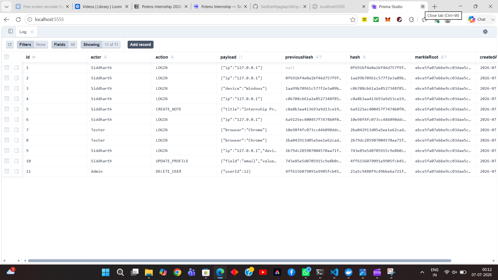
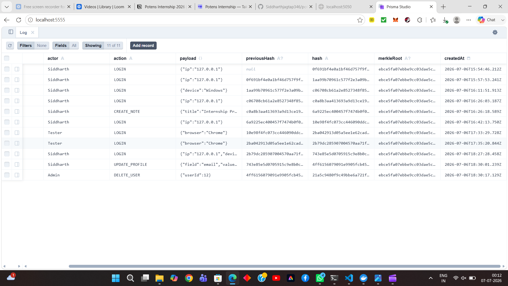

## 2. API Response (POST /log)

📷 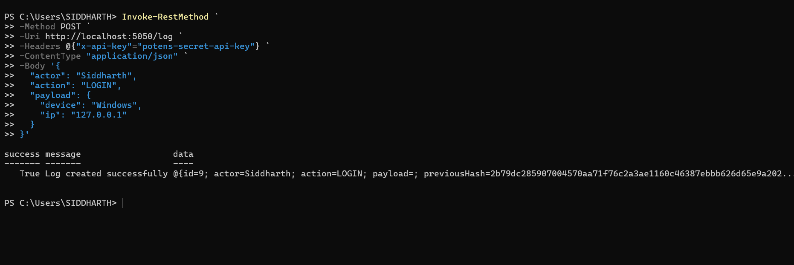
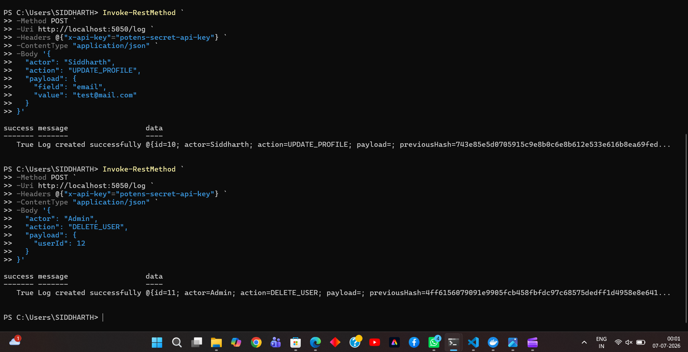


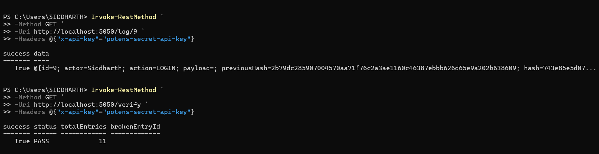

`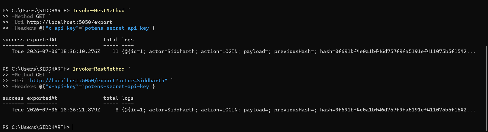
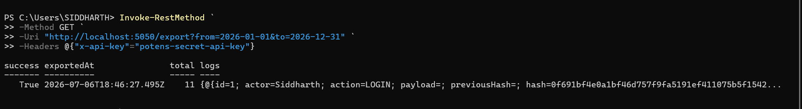

## 3. Chain Verification PASS

📷 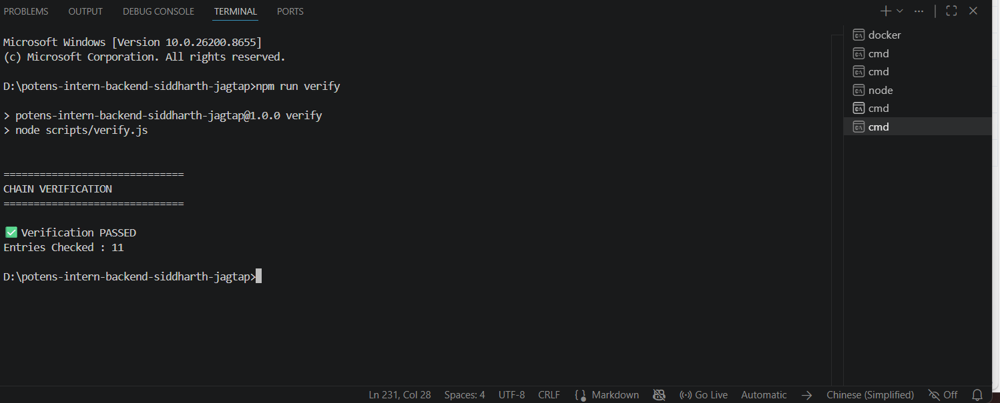


## 5. Docker Running Containers

📷 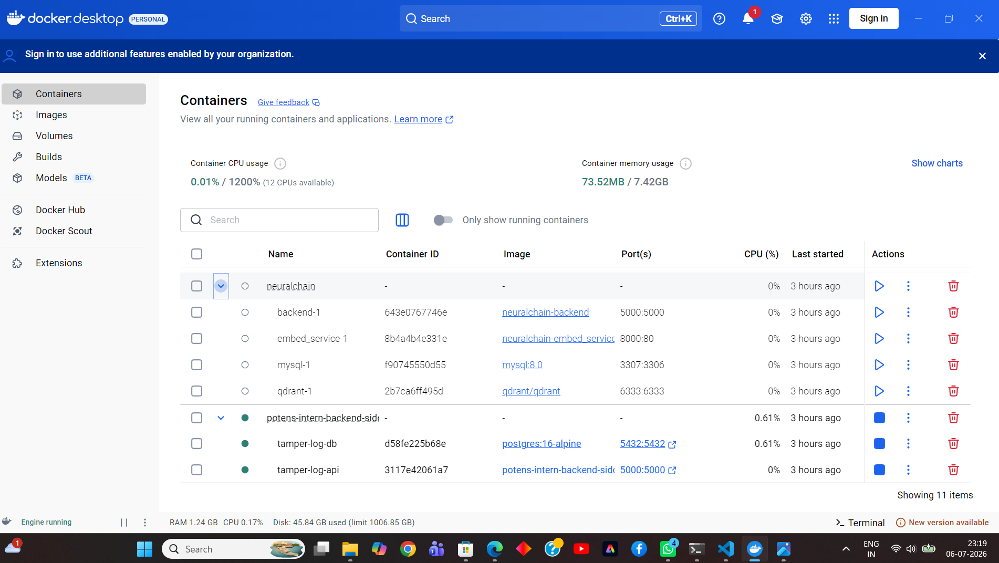

## 6. Test Results

📷 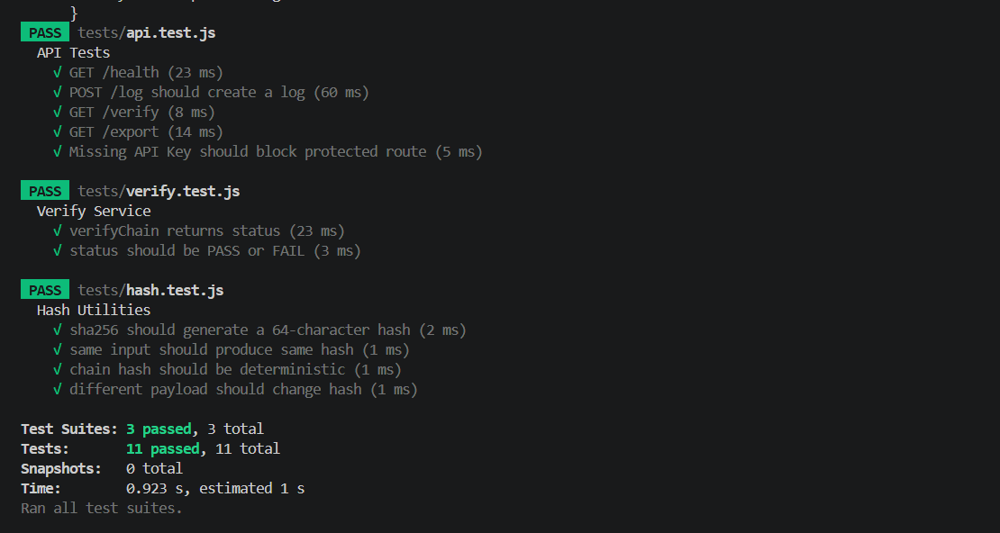
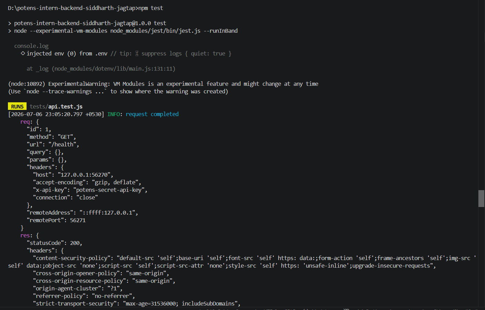
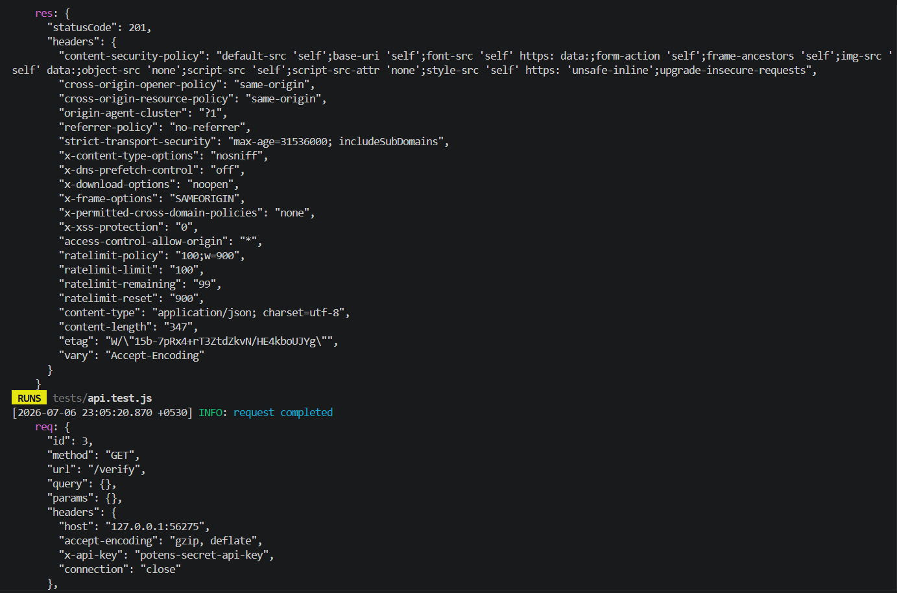
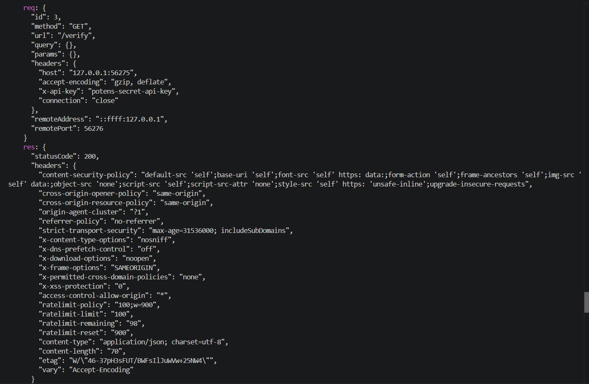
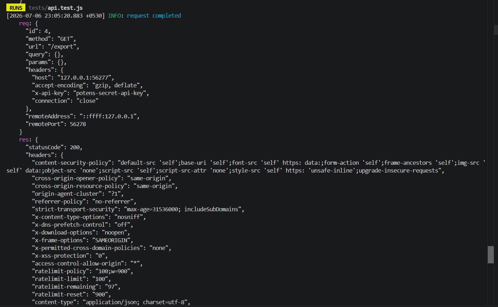
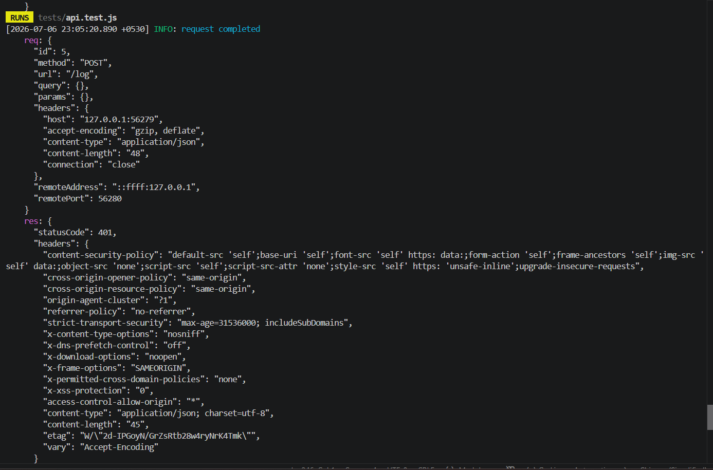

---

# 🧱 Design Decisions

### 1. SHA-256 Chain

Used to ensure:

* Tamper detection
* Deterministic hashing

### 2. Merkle Tree

Used to:

* Optimize batch verification
* Reduce recomputation cost

### 3. Prisma ORM

Used for:

* Type-safe DB operations
* Migration tracking

### 4. API Key Auth

Simple but effective:

* Prevents unauthorized writes


---

# 🚀 Future Improvements

* Event sourcing architecture
* Kafka ingestion pipeline
* Streaming verification
* Multi-node replication
* Graph-based log visualization

---

# 🤖 AI USAGE LOG (REQUIRED)

| Tool            | Usage                                              |
| --------------- | -------------------------------------------------- |
| ChatGPT         | Architecture design, backend generation, debugging |
| VS Code Copilot | Code suggestions                                   |
| Prisma Docs     | Schema reference                                   |

Approx usage:

* ~15k–25k tokens ChatGPT
* ~Light Copilot usage

---

# 🧪 What Was Implemented

✔ Express backend
✔ PostgreSQL + Prisma
✔ SHA-256 chain hashing
✔ Merkle tree batching
✔ API authentication
✔ Rate limiting
✔ Pino logging
✔ Jest + Supertest
✔ CLI verification tool
✔ Docker setup
✔ Export system
✔ Full audit verification system

---

# 🧠 Final Summary

This system behaves like a **mini blockchain-based audit log engine** with:

* Cryptographic integrity
* Immutable history
* Verifiable audit trail
* Scalable batch verification
* CLI + API + Docker support

---

# 📌 Submission Notes

This project was built as a **24-hour backend engineering challenge** focusing on:

* System design
* Data integrity
* API correctness
* Production readiness

---

# 🔥 End

```